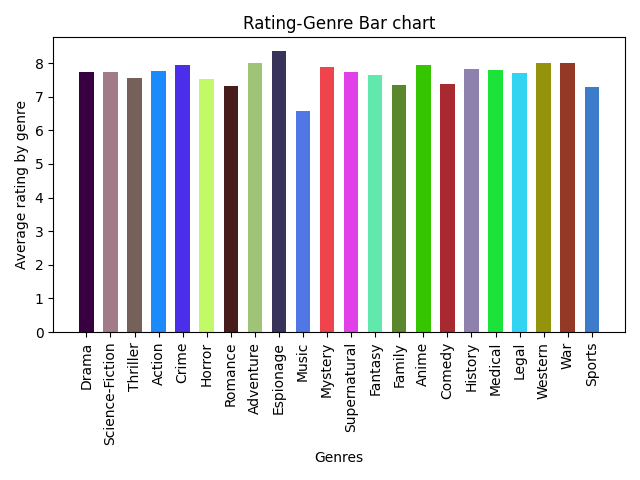

# TV Show CLI Project

## Description:
The program is a command-line interface application, it fetches data related to TV shows and movies using
a free and public API [TVMAZE API](https://api.tvmaze.com).

## Video Demo:  <https://youtu.be/XtHSBj0rWoU>

## Features:
The program allows the user to process the extracted data by choosing one out of three options and typing the specific command in the terminal: searching for a movie by name and displaying the basic information about it, sorting the available movies (all the movies of a specified genre or all by default) in the database in ascending or descending order by rating, plotting a bar chart of average ratings by movie genre.

* **Search**:
The program searches a single movie by name (case-insesitively and ignoring any leading or trailing whitespaces, the length of the command has to be valid) by making a GET request to the API.

The search by name tolerates typos and provides the closest answer based on the user's query. (it provides the information about the movie with the most similar name found in the database)

In case the response is invalid, an internal server error occurs or the movie is not found in the database
(the response is empty, the movie has no id key or no value for id) the program exits and a message is displayed for the user:
>"We found no matches in the database for the entry _current entry_. Try again!"

Otherwise a message and the basic information about the movie will be displayed on the screen:
>"We found a match in the database for the entry  _current entry_!"

The Beautiful Soup library is used for stripping html tags from some information provided by the API. (the summary of a movie might contain html tags in the response provided by the API, thus the html tags are stripped in order to ensure clarity and reduce future issues)

The program also handles missing  fields (keys) in the information provided about a movie by using
the get() method for dictionaries and specifying default values. It also handles fields (keys) which have the value set as None and sets another default value for them.

* **Sort**:
The program sorts the movies available in the database (the movies by a genre specified by the user, otherwise all the movies available) in ascending or descending order (as specified by  the user) by rating score. (the program filters out the movies that have no rating score available and does not include them in the list)

The command typed in the terminal by the user is validated: the length of the command has to be valid, the sorting is case-insensitive and ignores any trailing and leading whitespaces, the sorting can only be ascending or descending and the movie genre type has to be a valid movie genre. (at least a single movie of that genre exists in the database)

The final output is saved in a csv file (sorted_movies.csv) to ensure persistent storage and a clear format. (each movie and its rating score is represented on a single line)

* **Plot**:
The program plots a bar chart  (using matplotlib) of each genre and the average rating of the genre. (the genres in the plot are the grenres found in the database which have an average rating that can be calculated, in the case of movies that belong to multiple genres the rating is added to all the respective genres)

The command typed by the user (case-insestively and ignoring leading and trailing whitespaces) in the terminal for plotting is validated: the command must have a valid length, it also verifies that the user wants to plot genres by rating which is the only available functionality for plotting. In case the command is not valid, the program exits and displays a specific message to the user.

The program also uses the standard library random in order to randomize the colors of the chart each time the user enters the specific command for plotting in the terminal.

The backend of matplotlib is set to Agg in order to display the plot in a file and not in an interactive window.

The bar chart is then saved in a png file (plot.png) and a message is displayed to the user to ensure the program is user-friendly:
>"Plot saved as 'plot.png'"



## Files:
The project.py file contains the main code of the project written in Python.
The test_project.py file contains unit tests for five functions from the project.py file.
The requirements.txt file lists the third party packages used in the project.

## Libraries:
The programming language used for the project is Python. Both standard Python libraries and third-party libraries were used.

Python Standard Libraries:
* sys
* csv
* random

Third-Party Libraries:
* requests
* fancify-text
* Beautiful Soup
* matplotlib

## Installation:
You must have Python 3.x installed.

1. Clone the repository:

`git clone https://github.com/alexandrastroiu/TV-Show-CLI-Project.git`

2. To install the third-party packages used in the project use the command:

`pip install -r requirements.txt`

## Usage:
A valid search command for a movie which is available in the database is:

`python project.py --search name` - change name for the name of the movie you want to search

`python project.py --search "multiple words name"` - type like this for a movie name with multiple words

`python project.py --search friends`

Other equivalent commands for the prior command are:
```
python project.py --SEARCH FRIENDS
python project.py --SeArcH FrIenDs
python project.py      --SearCH       Friends
```

A few valid sort commands are:
`python project.py --sort order genre`
- change order for asc (ascending) or desc (descending)
- change genre for a valid genre
- if genre is not specified, all movies are sorted by default

The valid genres are:
* Adventure, History, Thriller
* Drama, Fantasy, Espionage
* Western, Sports, Supernatural
* Horror, Romance, Crime
* Legal, Family, Medical
* Music, Anime, Action
* Comedy, Science-Fiction, War, Mystery

`python project.py --sort asc` - sorts available movies in ascending order by rating

`python project.py --sort desc` - sorts available movies in descending order by rating

`python project.py --sort asc Romance`  - sorts available Romance movies in ascending order by rating

`python project.py --SORT ASC ROMANCE`  - equivalent command

`python project.py --SoRt AsC RomanCe` - equivalent command

`python project.py --SORT      asc    Romance`

`python project.py --sort  desc Romance` - sorts available Romance movies in descending order by rating

`python project.py --sort desc Horror` - sorts available Romance movies in descending order by rating

`python project.py --sort Romance` - invalid command

`python project.py --sort` - invalid command

The valid plot command is:

`python project.py --plot rating genres` - do no change the words

Some equivalent commands are:
```
python project.py --PLOT RATING GENRES
python project.py --PloT RaTiNg GeNrEs
python project.py    --PLoT    rAtiNg    Genres
```

